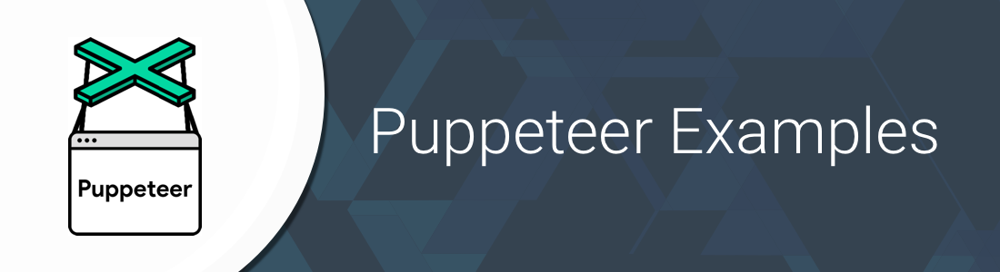

### Show some :heart: and star the repo to support the project
     

Main repository containing all the example scripts demonstrating features/functionality in [Puppeteer](https://github.com/GoogleChrome/puppeteer) (Headless Chrome Node API)

## Example scripts

1. [Download file from redirecting link](/download_file_redirect_link)

# Pull Requests
I welcome and encourage all pull requests. It usually will take me within 24-48 hours to respond to any issue or request. Here are some basic rules to follow to ensure timely addition of your request:
  1. If its a feature, bugfix, or anything please only change code to what you specify.
  1. Please keep PR titles easy to read and descriptive of changes, this will make them easier to merge :)
  1. Pull requests _must_ be made against `develop` branch. Any other branch (unless specified by the maintainers) will get rejected.
  1. Check for existing [issues](https://github.com/nisrulz/puppeteer-examples/issues) first, before filing an issue.
  1. Have fun!

### Created & Maintained By
[Nishant Srivastava](https://github.com/nisrulz) ([@nisrulz](https://www.twitter.com/nisrulz))

If you appreciate my work, consider [buying me](https://www.paypal.me/nisrulz/5usd) a cup of :coffee: to keep me recharged :metal: [[PayPal](https://www.paypal.me/nisrulz/5usd)]

License
=======

    Copyright 2017 Nishant Srivastava

    Licensed under the Apache License, Version 2.0 (the "License");
    you may not use this file except in compliance with the License.
    You may obtain a copy of the License at

       http://www.apache.org/licenses/LICENSE-2.0

    Unless required by applicable law or agreed to in writing, software
    distributed under the License is distributed on an "AS IS" BASIS,
    WITHOUT WARRANTIES OR CONDITIONS OF ANY KIND, either express or implied.
    See the License for the specific language governing permissions and
    limitations under the License.
